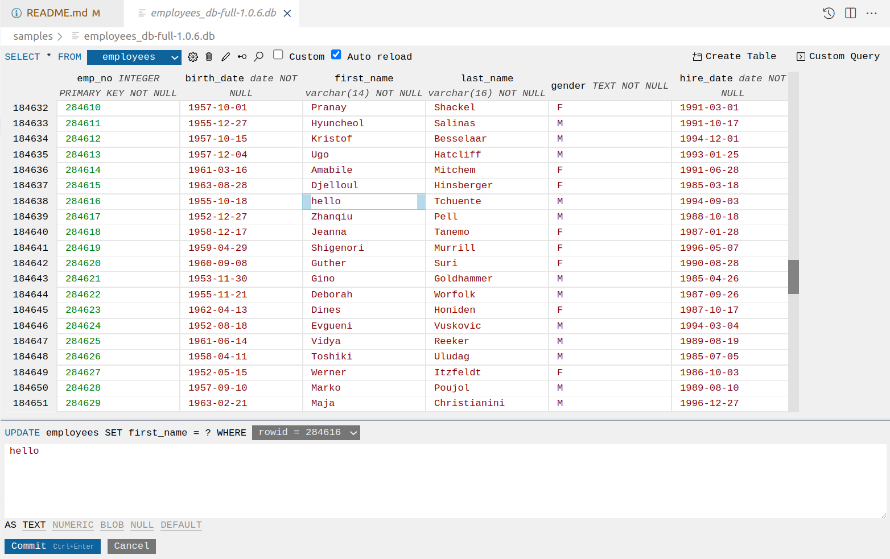

# SQLite3 Editor
Edit SQLite files like you would in Excel.

**IMPORTANT**: this extension is dependent on **Python 3.7+**

This extension uses the `sqlite3` module in the standard library of Python to query sqlite3 databases. It searches through the PATH for a Python 3 binary, but if it can't find one or the wrong version of Python is selected, you can specify the filepath of a python binary in the config `sqlite3-editor.pythonPath`.

## Features
- **Supported statements**: ALTER TABLE, CREATE TABLE, DELETE, DROP TABLE, DROP VIEW, INSERT, UPDATE, CREATE INDEX, DROP INDEX, and custom queries.
- **Click a cell and UPDATE in-place** with an intuitive GUI.
- **Find widget** to filter records with **regex**, **whole word**, and **case-sensitivity** switches.
- **Efficiently** edit large tables by **only querying the visible area**.
- **Auto-reload** when the table is modified by another process.

## Screenshot

